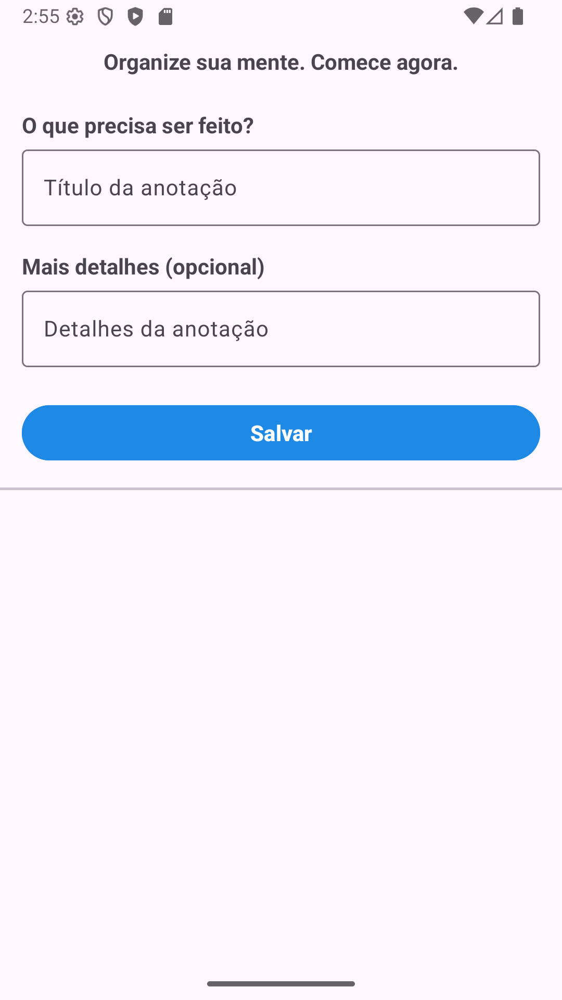

## Descrição do Aplicativo — To-Do List

Este é um aplicativo Android nativo, desenvolvido totalmente em Java, destinado ao gerenciamento de tarefas pessoais de forma simples e rápida.

Com ele, o usuário consegue:

✅ Adicionar tarefas: Criar uma nova anotação para suas atividades. 

✅ Visualizar a lista de tarefas: Todas as tarefas são exibidas em um RecyclerView, mostrando o nome da atividade. 

✅ Salvar temporariamente: Os dados são armazenados apenas na memória, ou seja, ao fechar o aplicativo, a lista é removida, já que ele ainda não faz uso de um banco de dados (como o Room) para persistir as tarefas. 

✅ Remover tarefas: É possível excluir uma tarefa da lista, removendo-a da memória.
#

 
   
   

